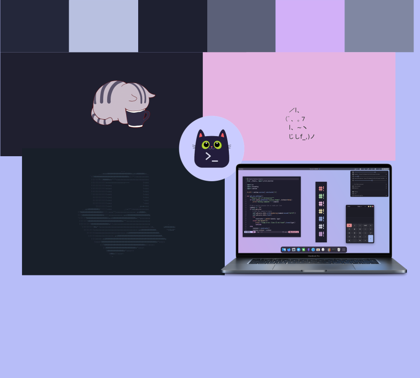

# JOA-BO
Beroepsopdracht 2e klas 1e periode.

# Setup
1. Start de Docker Daemon:
    * Linux: `dockerd` in je terminal
    * Windows: start `Docker Desktop`
    * Mac: ???

2. Run `docker-compose up`

3. Bezoek de site via je browser:
    * http://127.0.0.1:8080 (http://localhost:8080 werkt ook)

# Moodboard


# License
- Afbeeldingen zijn gelicensed onder [Creative Commons](http://creativecommons.org)
- Het project zelf is gelicensed onder General Public License V3

```
This project is free software: you can redistribute it and/or modify it under the terms of the GNU General Public License as published by the Free Software Foundation, 
either version 3 of the License, or (at your option) any later version.

This project is distributed in the hope that it will be useful, but WITHOUT ANY WARRANTY; 
without even the implied warranty of MERCHANTABILITY or FITNESS FOR A PARTICULAR PURPOSE. 
See the GNU General Public License for more details.

You should have received a copy of the GNU General Public License along with this code. 
If not, see <https://www.gnu.org/licenses/>. 
```